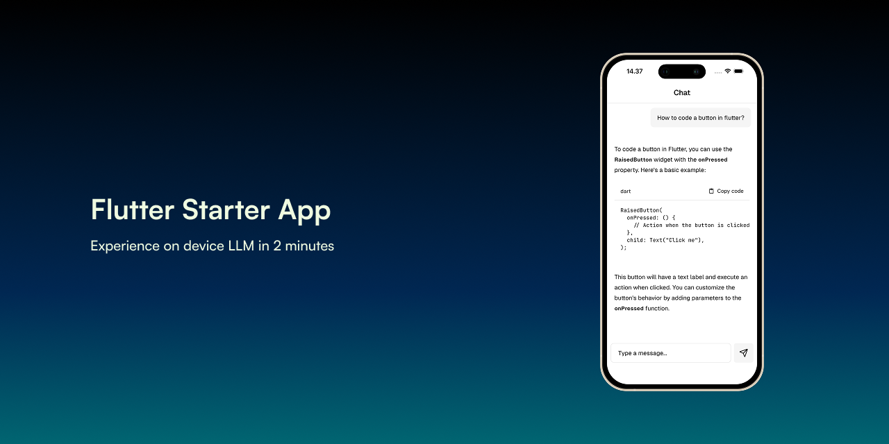

[](https://discord.gg/qhaMc2qCYB)
[](https://matrix.to/#/#nobodywho:matrix.org)
[](https://mastodon.gamedev.place/@nobodywho)
[](https://docs.nobodywho.ooo)

# NobodyWho Flutter Starter App

This starter app demonstrates the capabilities of **[NobodyWho](https://github.com/nobodywho-ooo/nobodywho)**, a library designed to run LLMs locally and efficiently on any device.

## Features

- **Chat** — stream responses from a local LLM
- **Tool calling** — give the model access to custom functions (e.g. weather, calculator)
- **Vision & Hearing** — image & audio ingestion with a multimodal model
- **Embeddings & RAG** — semantic search with an embedding model and cross-encoder reranker

The app has been tested on **iOS, Android, and macOS**, and should also work on **Linux and Windows**. Flutter Web is not currently supported.

---

## Getting Started

### 1. Install Dependencies

```bash
flutter pub get
```

### 2. Download Models

In production, we recommend on-demand download, so you download the models when needed, using a library like `background_downloader` for advance options or with our download method. This keeps your app size small. For development, an easy solution is to download the models and include them directly in your assets folder (see script below).

#### Automated (Recommended)

**Chat only** (minimal setup):

| Platform       | Command                              |
|----------------|--------------------------------------|
| macOS / Linux  | `./scripts/download_chat.sh`   |
| Windows        | `.\scripts\download_chat.ps1`  |

**All features** (chat + vision + hearing + embeddings + reranker):

| Platform       | Command                                                                               |
|----------------|---------------------------------------------------------------------------------------|
| macOS / Linux  | `./scripts/download_chat_multimodal.sh && ./scripts/download_embedding_rerank.sh`         |
| Windows        | `.\scripts\download_chat_multimodal.ps1; .\scripts\download_embedding_rerank.ps1`         |

The scripts download models from Hugging Face, rename them, and place them in the `assets/` folder.

#### Download with nobodyWho.Chat

Load models directly from Hugging Face using `hf://` URLs (e.g. `hf://owner/repo/model.gguf`). Also supports plain HTTP/HTTPS URLs. Models are cached locally and re-used on subsequent loads. Works on Android with proper cache directory selection.

Example:

```dart
final chat = await nobodywho.Chat.fromPath(
  modelPath: 'hf:NobodyWho/Qwen_Qwen3-0.6B-GGUF/Qwen_Qwen3-0.6B-Q4_K_M.gguf',
);
```

#### Manual Download

You can use any `.gguf` model from [Hugging Face](https://huggingface.co/models).

**Chat models** — some worth considering: Qwen, Gemma, LFM, and Ministral, available in [this collection](https://huggingface.co/unsloth/collections).

**Multimodal models** — some examples by modality: [Vision](https://huggingface.co/LiquidAI/LFM2-VL-450M-GGUF/tree/main), [Hearing](https://huggingface.co/ggml-org/ultravox-v0_5-llama-3_2-1b-GGUF/tree/main), [Vision + Hearing](https://huggingface.co/unsloth/gemma-4-E2B-it-GGUF/tree/main)

Compatibility notes:

- Most GGUF models will work, but some may fail due to formatting issues. Here are some [models](https://huggingface.co/NobodyWho/collections) we have made sure they work perfectly.
- For mobile devices, models under 1 GB tend to run smoothly. As a general rule, the device should have at least twice the available RAM as the model file size. Note that available RAM differs from total RAM — iOS typically reserves around 1–2 GB for the kernel and system processes, while Android overhead varies by manufacturer: roughly 2 GB on stock Android (e.g. Pixel devices), and between 2–4 GB on Samsung, Xiaomi, and Oppo devices due to additional services.

Keep in mind:

- **Tool calling**: the chat model must support function/tool calling.
- **Vision & Hearing**: the multimodal model and projection model must be compatible with each other.

Minimum recommended specs:

- **iOS**: iPhone 11 or newer with at least 4 GB of RAM.
- **Android**: Snapdragon 855 / Adreno 640 / 6 GB RAM or better.

### 3. Run the App

```bash
flutter run
```

Or target a specific platform:

```bash
flutter run -d ios
flutter run -d android
flutter run -d macos
```

---

## Notes

- **Singleton**: Keep the NobodyWho engine as a singleton. This example uses `get_it`, but any DI solution works.
- **Model changes**: After swapping a model file, delete the app from the simulator/device so the old cached model is cleared. `flutter clean` can also help.
- **iOS / macOS native assets**: If you see an error about `objective_c.dylib` not loading, make sure you have run `flutter config --enable-native-assets` and rebuilt the app.

---

## Feedback & Contributions

We welcome your feedback and ideas!

- **Bug Reports & Improvements**: Open an issue on the **[Issues](https://github.com/nobodywho-ooo/flutter-starter-example/issues)** page.
- **Feature Requests & Questions**: Join the discussion on **[Discussions](https://github.com/nobodywho-ooo/flutter-starter-example/discussions)**.
